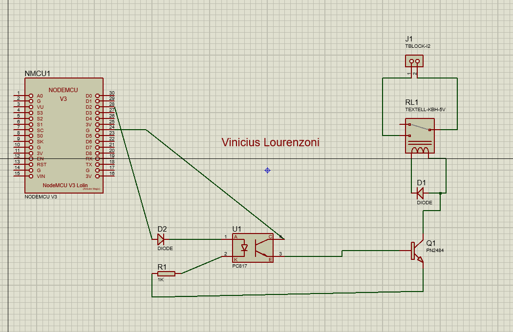
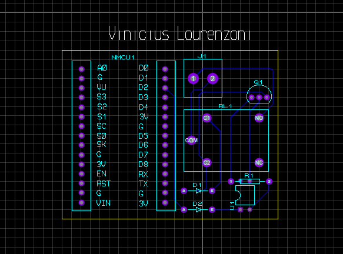
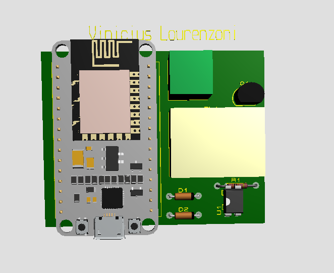
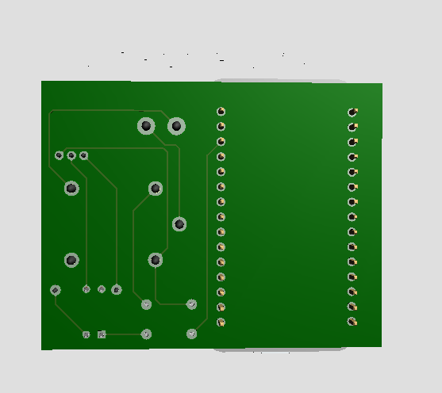

# Título do Projeto

Esse projeto visa desenvolver uma placa PCB partindo de um protótipo com o microcontrolador NodeMCU8266.

## Etapa 1: Implementação do NodeMCU no Proteus

### Etapa 1.1: Extraia os arquivos da pasta zip e cole-os nas pastas corretas do software Proteus.

- USERDVC.LIB, USERDVC.IDX e USERPKG.LIB, USERPKG.IDX na Biblioteca (Library)
- ESP8277.STP na pasta MCAD do software Proteus (pasta principal)

### Etapa 1.2: Localize as pastas Library e MCAD dentro da pasta de dados do software Proteus.

- No Proteus 8, a pasta Library e a pasta MCAD estarão dentro da pasta de dados (Proteus 8 Professional Data LIBRARY) ou ProgramData (C: ProgramData/Labcenter Electronics Proteus 8 Professional - LIBRARY e pasta MCAD)

### Etapa 1.3: Reinicie o software Proteus e abra a guia Adicionar componente. Procure por NodeMCU.

## Esquemático do módulo de relé

## PCB Layout

## 3D Frente e Verso

